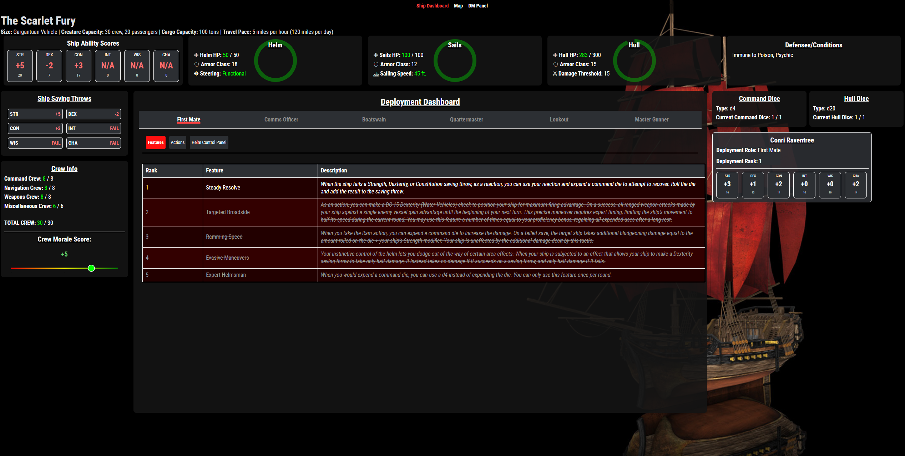
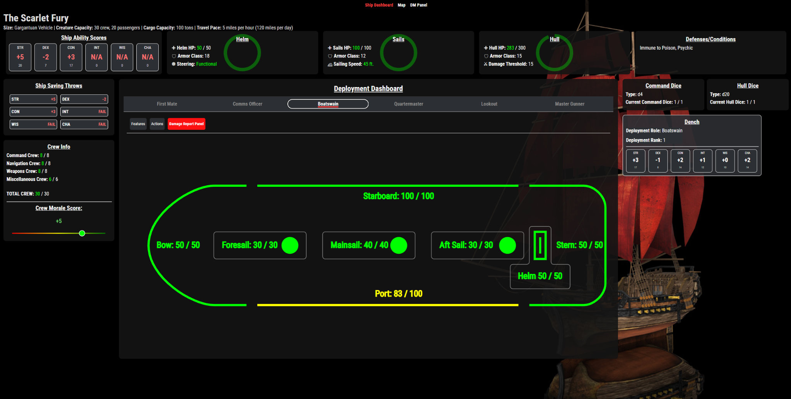
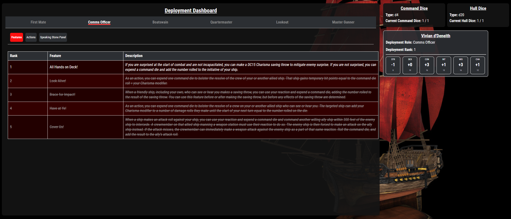
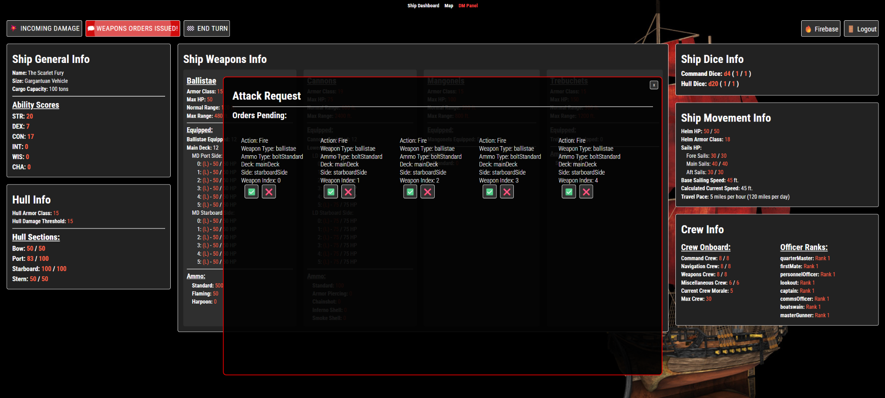
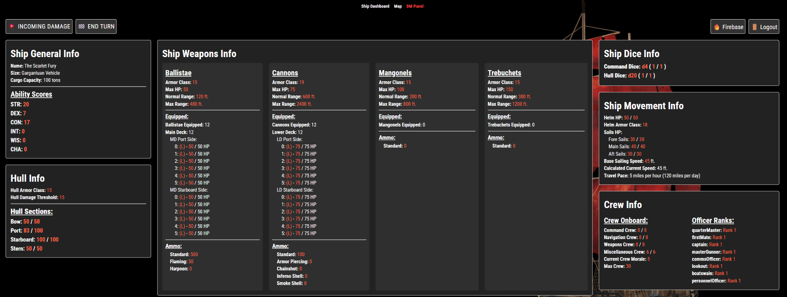

# 🏴‍☠️ D&D Ship Dashboard  
*A full-featured React web application for managing naval combat in Dungeons & Dragons 5e.*

---

## 🚀 Overview

The **D&D Ship Dashboard** is an interactive, data-driven web app built in **React** to streamline the complex rules of naval combat in D&D 5th Edition. It centralizes ship statistics, crew assignments, hull integrity, weapons management, morale, movement, and DM-controlled events into a fast, intuitive interface.

Originally designed for my long-running campaign *The Scarlet Fury’s Wake*, this tool eliminates pages of reference material and replaces them with a real-time, visual experience.

This project demonstrates:

- Complex front-end state management  
- Interactive UI/UX design for rapid gameplay decisions  
- Modular React architecture  
- Dynamic SVG rendering for ship layouts  
- Real-time DM override systems  
- Firebase-authenticated control panel (optional)  

A larger professional project (*Kizu Web Platform*) cannot be made public due to contract restrictions, but code can be reviewed privately in interview upon request.

---

## 🌐 Live Demo

**https://scarletfury.fun/**  
*(If temporarily offline, the dashboard may be undergoing updates.)*

---

## 🛠 Tech Stack

- **React (JavaScript)**  
- **React Router**  
- **Firebase / Firestore** (authentication + persistent state)  
- **Custom CSS Modules / Theming**  
- **Vite** for fast development bundling  
- **SVG-based visualizations**  
- **Framer Motion** (optional animations)  

---

# ⚙️ Features

## 🛳️ 1. Full Ship Status Overview

- Ship ability scores  
- Saving throws  
- Crew composition and totals  
- Crew morale tracker  
- Sails health  
- Helm status  
- Hull AC & threshold  
- Dynamic hull section HP visualization

---

## 🧭 2. Deployment Dashboard (Officer Management)

Select from officer roles:

- First Mate  
- Comms Officer  
- Boatswain  
- Quartermaster  
- Lookout  
- Master Gunner  

Each role presents:

- Crew assignments  
- Role features  
- Action options  
- Special interactions  
- DM-adjustable events  

---

## 🎯 3. Advanced Weapons Management System

Tracks:

- Ballistae and cannons across decks  
- Individual weapon HP  
- Ammo type + quantity  
- Action limits per turn  
- Pending fire orders  
- Automatic hit/damage roll generation  
- DM approval flow

### Pending Orders Modal

### Approved Attacks

---

## ⚔️ 4. Turn-Based Combat Workflow

- **Incoming damage** modal  
- **End Turn** progression  
- Visual HP state changes (green → yellow → red)  
- Automatic calculation of movement speed  
- Ship speed based on sails + helm health  

---

## 🎮 5. DM Control Panel

Protected behind Firebase Authentication.

DM can:

- Override any ship stat  
- Apply incoming damage  
- Adjust crew morale  
- Manage officer ranks  
- Update weapons and ammo  
- Save/load game state via JSON  
- Trigger combat events  

### DM Panel

---

## 🧠 6. UI/UX Built for Fast Decision-Making

- Highly visual hull and weapon layouts  
- Color-coded warnings  
- Minimal-click workflows  
- Easy-to-read typography  
- Dark theme for table readability  
- Responsive design  

---

